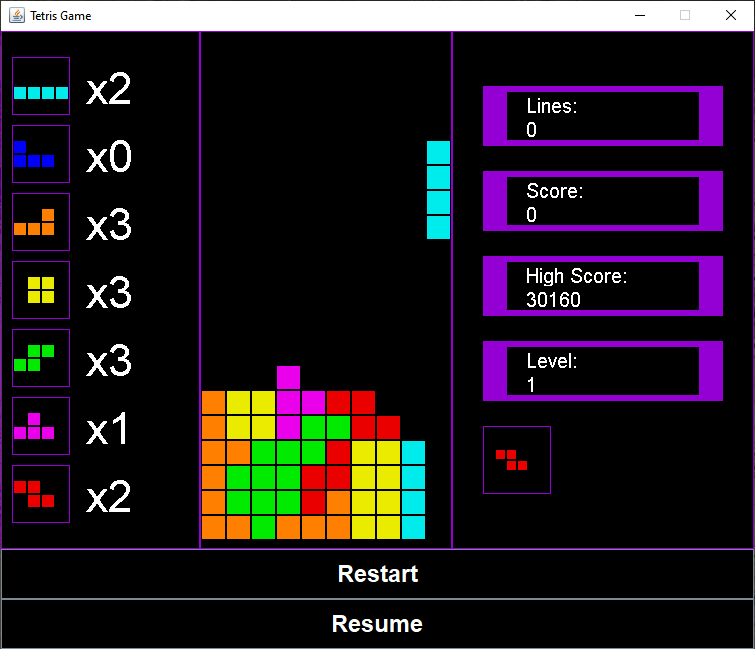

# Brettris - A Java Tetris Clone

This program is a java clone of the game Tetris, which I coded in order to extend my programming skills and to assist others' learning by making it publicly available. 

There are other Tetris clone implementations available online, yet the comments are typically insufficient for most beginner or intermediate programmers to readily understand, particularly when they're made using a game engine such as Unity, which requires a plethora of prerequisite knowledge; thus, I decided to create a more beginner-friendly implementation in java.

The program also offers a 'testing' mode that can be used to thoroughly evaluate the implementation or to hone one's strategies and skills.

Note: this Tetris clone is somewhat different to other implementations, particularly as regards the scoring system.

# Language

This program was coded and run in Java (v. 2021-12, 4.22.0).

# Instructions

1. Either (a) clone or (b) download and extract the repository to the root folder of an empty Java project.
2. Familiarise yourself with the controls (see Tetris.java).
3. Compile and run.

# Screenshot

